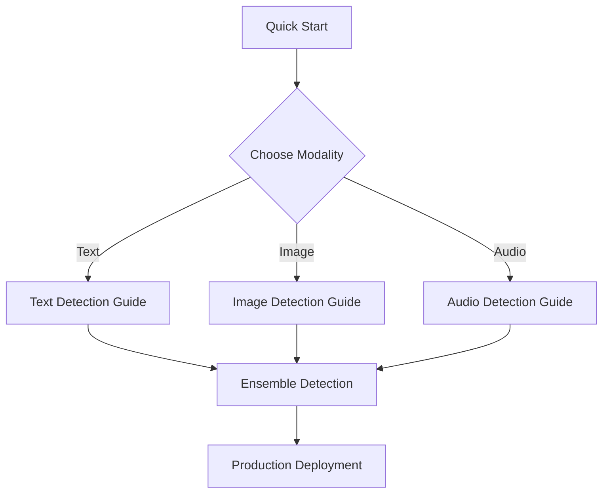

# Tutorials

Welcome to the Veridex tutorials! These guides will help you master AI content detection across all modalities.

---

## 🎯 Learning Path

Follow these tutorials in order for the best learning experience:

---

## Available Tutorials

### 🚀 Getting Started

  <h3><a href="quick_start/">Quick Start (5 minutes)</a></h3>
  
Get up and running with Veridex in under 5 minutes. Perfect for first-time users.

  
<strong>You'll learn:</strong>

  <ul>
    <li>How to install Veridex</li>
    <li>Run your first detection</li>
    <li>Interpret results</li>
  </ul>
  Beginner
  5 min

---

### 📝 Text Detection

  <h3><a href="text_detection_guide/">Text Detection Guide</a></h3>
  
Learn to detect AI-generated text using various signals and techniques.

  
<strong>You'll learn:</strong>

  <ul>
    <li>Choosing the right text detector</li>
    <li>Understanding perplexity and burstiness</li>
    <li>Using Binoculars for high accuracy</li>
    <li>Interpreting linguistic signals</li>
  </ul>
  Beginner-Intermediate
  15 min

---

### 🖼️ Image Detection

  <h3><a href="image_detection_guide/">Image Detection Guide</a></h3>
  
Master image deepfake detection with frequency analysis and diffusion techniques.

  
<strong>You'll learn:</strong>

  <ul>
    <li>Image preprocessing best practices</li>
    <li>Frequency domain analysis</li>
    <li>Using DIRE for diffusion artifacts</li>
    <li>Error Level Analysis (ELA)</li>
    <li>GPU vs CPU considerations</li>
  </ul>
  Intermediate
  20 min

---

### 🎵 Audio Detection

  <h3><a href="audio_detection_guide/">Audio Detection Guide</a></h3>
  
Detect synthetic voice and deepfake audio using spectral and foundation model approaches.

  
<strong>You'll learn:</strong>

  <ul>
    <li>Audio format requirements</li>
    <li>Spectral analysis for quick screening</li>
    <li>AASIST for anti-spoofing</li>
    <li>Wav2Vec for production-grade detection</li>
    <li>Silence pattern analysis</li>
  </ul>
  Intermediate
  20 min

---

### 🎯 Advanced Topics

  <h3><a href="ensemble_detection/">Ensemble Detection</a></h3>
  
Combine multiple signals for robust, production-ready detection.

  
<strong>You'll learn:</strong>

  <ul>
    <li>Fusion strategies for multiple signals</li>
    <li>Building custom detection pipelines</li>
    <li>Confidence calibration</li>
    <li>Production deployment patterns</li>
  </ul>
  Advanced
  25 min

---

## 💡 Tutorial Tips

!!! tip "Best Practices"
    - **Start with Quick Start** - Get familiar with the basics first
    - **Run the code** - All examples are tested and working
    - **Experiment** - Try different parameters and inputs
    - **Read the concepts** - Understanding the theory helps with practical application

!!! warning "Prerequisites"
    - Python 3.9 or higher
    - Basic understanding of Python
    - Optional: Familiarity with machine learning concepts

---

## 📚 Additional Resources

After completing the tutorials, check out:

- [Concepts Documentation](../concepts/index.md) - Deep dive into the architecture
- [API Reference](../api/core.md) - Complete API documentation
- [Use Cases](../use_cases.md) - Real-world applications
- [FAQ](../faq.md) - Common questions and answers

---

## 🆘 Need Help?

If you get stuck:

1. Check the [Troubleshooting Guide](../troubleshooting.md)
2. Review the [FAQ](../faq.md)
3. Search [GitHub Issues](https://github.com/ADITYAMAHAKALI/veridex/issues)
4. Ask in [GitHub Discussions](https://github.com/ADITYAMAHAKALI/veridex/discussions)

---

  <h3>🎯 Ready to Start?</h3>
  
Begin with the <a href="quick_start/">Quick Start Tutorial</a> to get hands-on experience!

