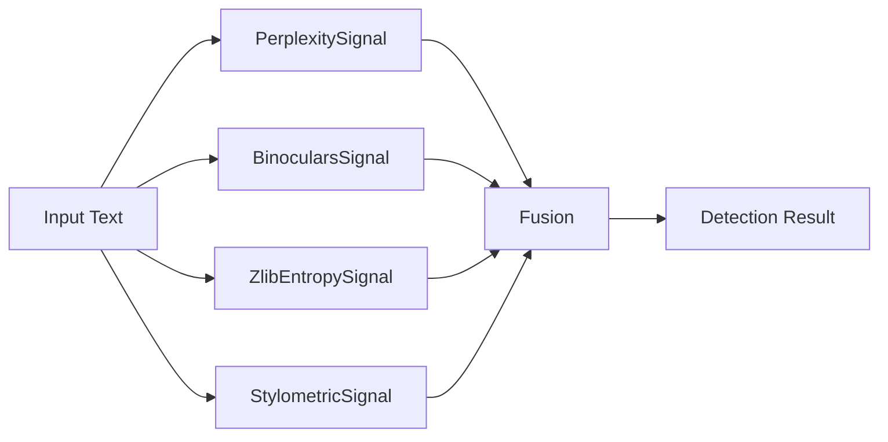
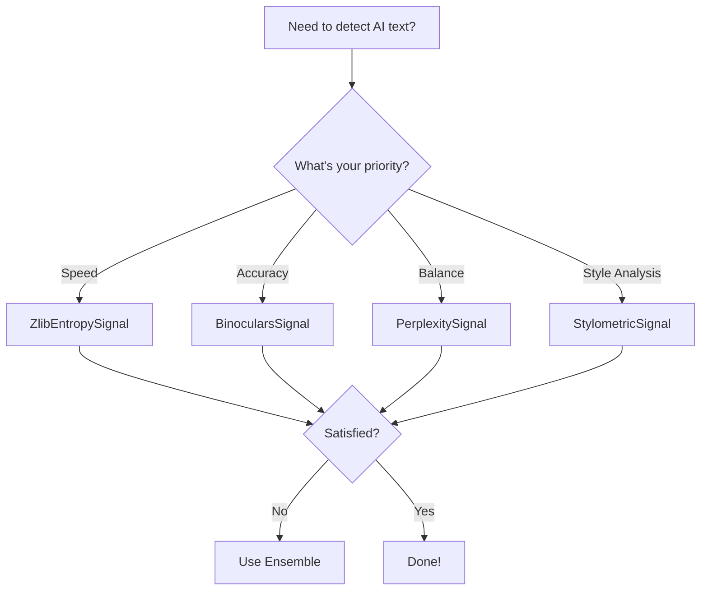

# Text Detection Guide

Learn to detect AI-generated text using Veridex's comprehensive suite of text signals.

---

## Overview

Text detection in Veridex uses multiple complementary signals:

- **Statistical Signals**: Analyze perplexity and predictability
- **Compression Signals**: Measure information entropy
- **Linguistic Signals**: Examine writing style patterns



---

## Available Text Detectors

### 1. PerplexitySignal (Recommended)

**Best for**: General-purpose text detection

```python
from veridex.text import PerplexitySignal

detector = PerplexitySignal(model_id="gpt2")
result = detector.run("The artificial intelligence has revolutionized modern computing.")

print(f"AI Probability: {result.score:.2%}")
print(f"Mean Perplexity: {result.metadata['mean_perplexity']:.2f}")
```

**How it works**:
- Measures how "surprised" a language model is by the text
- Low perplexity = predictable = likely AI-generated
- Uses GPT-2 by default (can use larger models)

**Pros**:
- Good accuracy
- Interpretable scores
- Works on short texts

**Cons**:
- Requires model download (~500MB)
- Slower than compression-based methods
- GPU optional but recommended

---

### 2. BinocularsSignal (Highest Accuracy)

**Best for**: When accuracy is critical

```python
from veridex.text import BinocularsSignal

detector = BinocularsSignal()
result = detector.run("Your text to analyze...")

print(f"AI Probability: {result.score:.2%}")
print(f"Binoculars Score: {result.metadata.get('binoculars_score', 'N/A')}")
```

**How it works**:
- Uses contrastive perplexity between two models
- Compares GPT-2 and Falcon predictions
- Based on research paper: arXiv:2401.12070

**Pros**:
- Highest accuracy among text detectors
- Robust to paraphrasing
- Research-backed methodology

**Cons**:
- Large model download (~7GB)
- Slower than other detectors
- Requires more compute

---

### 3. ZlibEntropySignal (Fastest)

**Best for**: Quick screening, large-scale processing

```python
from veridex.text import ZlibEntropySignal

detector = ZlibEntropySignal()
result = detector.run("Your text here...")

print(f"AI Probability: {result.score:.2%}")
print(f"Compression Ratio: {result.metadata.get('compression_ratio', 'N/A')}")
```

**How it works**:
- Compresses text using zlib
- AI-generated text often compresses better
- No ML model required

**Pros**:
- Extremely fast
- No model download
- Low computational cost

**Cons**:
- Lower accuracy than ML-based methods
- Sensitive to text length
- Best as first-pass filter

---

### 4. StylometricSignal

**Best for**: Style and pattern analysis

```python
from veridex.text import StylometricSignal

detector = StylometricSignal()
result = detector.run("Your text here...")

print(f"AI Probability: {result.score:.2%}")
print(f"Stylometric Features: {result.metadata}")
```

**How it works**:
- Analyzes linguistic patterns
- Examines sentence structure, vocabulary, etc.
- Rule-based heuristics

**Pros**:
- Fast
- No model download
- Interpretable features

**Cons**:
- Lower accuracy alone
- Best combined with other signals

---

## Choosing the Right Detector

Use this decision tree:



**Quick Reference**:

| Priority | Detector | Speed | Accuracy | Model Size |
|----------|----------|-------|----------|------------|
| **Speed** | `ZlibEntropySignal` | ⚡⚡⚡ | ⭐ | None |
| **Balance** | `PerplexitySignal` | ⚡⚡ | ⭐⭐ | 500MB |
| **Accuracy** | `BinocularsSignal` | ⚡ | ⭐⭐⭐ | 7GB |
| **Style** | `StylometricSignal` | ⚡⚡⚡ | ⭐ | None |

---

## Practical Examples

### Example 1: Analyzing Student Essays

```python
from veridex.text import PerplexitySignal

detector = PerplexitySignal()

essay = """
The impact of climate change on global ecosystems represents one of 
the most pressing challenges of our time. Rising temperatures, shifting 
precipitation patterns, and increased frequency of extreme weather events 
are fundamentally altering the delicate balance of nature.
"""

result = detector.run(essay)

if result.score > 0.7 and result.confidence > 0.6:
    print("⚠️  High probability of AI-generated content")
elif result.score > 0.3:
    print("⚠️  Uncertain - recommend manual review")
else:
    print("✓ Likely human-written")

print(f"\nDetailed Results:")
print(f"  AI Probability: {result.score:.2%}")
print(f"  Confidence: {result.confidence:.2%}")
print(f"  Perplexity: {result.metadata['mean_perplexity']:.2f}")
```

### Example 2: Batch Processing

```python
from veridex.text import PerplexitySignal
import pandas as pd

detector = PerplexitySignal()

texts = [
    "AI-generated text example 1...",
    "Human-written text example 2...",
    "Another text to analyze...",
]

results = []
for i, text in enumerate(texts):
    result = detector.run(text)
    results.append({
        'text_id': i,
        'score': result.score,
        'confidence': result.confidence,
        'perplexity': result.metadata.get('mean_perplexity', 0)
    })

df = pd.DataFrame(results)
print(df)
```

### Example 3: Ensemble Approach

```python
from veridex.text import PerplexitySignal, ZlibEntropySignal, StylometricSignal

text = "Your text to analyze..."

# Run multiple detectors
detectors = [
    PerplexitySignal(),
    ZlibEntropySignal(),
    StylometricSignal()
]

scores = []
confidences = []

for detector in detectors:
    result = detector.run(text)
    scores.append(result.score)
    confidences.append(result.confidence)
    print(f"{detector.__class__.__name__}: {result.score:.2%}")

# Simple weighted average
avg_score = sum(scores) / len(scores)
avg_confidence = sum(confidences) / len(confidences)

print(f"\nEnsemble Result:")
print(f"  Average Score: {avg_score:.2%}")
print(f"  Average Confidence: {avg_confidence:.2%}")
```

---

## Interpreting Results

### Understanding Perplexity

**Perplexity** measures how "surprised" a language model is:

- **Low perplexity (< 20)**: Text is very predictable → likely AI-generated
- **Medium perplexity (20-50)**: Moderately predictable → uncertain
- **High perplexity (> 50)**: Unpredictable → likely human-written

!!! example "Perplexity Examples"
    - "The cat sat on the mat." → Low perplexity (common phrase)
    - "Quantum entanglement defies locality." → Higher perplexity (technical)

### Understanding Burstiness

**Burstiness** measures variation in sentence complexity:

- **Low burstiness**: Uniform sentences → AI-like
- **High burstiness**: Varied complexity → human-like

Humans naturally mix simple and complex sentences.

---

## Best Practices

### 1. Text Preprocessing

```python
def preprocess_text(text):
    """Clean text before detection"""
    # Remove extra whitespace
    text = " ".join(text.split())
    
    # Minimum length check
    if len(text.split()) < 10:
        print("Warning: Text too short for reliable detection")
    
    return text

text = preprocess_text(input_text)
result = detector.run(text)
```

### 2. Handle Short Texts Carefully

```python
from veridex.text import PerplexitySignal

detector = PerplexitySignal()
text = "Short text here"

result = detector.run(text)

if len(text.split()) < 50:
    print("⚠️  Warning: Short text may give unreliable results")
    if result.confidence < 0.5:
        print("  → Consider this result uncertain")
```

### 3. Use Multiple Signals

```python
def comprehensive_text_check(text):
    """Use multiple detectors for robust detection"""
    from veridex.text import PerplexitySignal, ZlibEntropySignal
    
    # Quick filter first
    quick_detector = ZlibEntropySignal()
    quick_result = quick_detector.run(text)
    
    if quick_result.score < 0.3:
        # Likely human, skip expensive check
        return quick_result
    
    # Run more accurate detector
    accurate_detector = PerplexitySignal()
    return accurate_detector.run(text)
```

---

## Common Pitfalls

!!! warning "Avoid These Mistakes"
    1. **Don't rely on a single signal alone** - Combine multiple detectors
    2. **Check confidence, not just score** - Low confidence = unreliable
    3. **Consider text length** - Very short texts are hard to detect
    4. **Update regularly** - Models evolve, so should detection
    5. **Don't use as sole evidence** - Always combine with human judgment

---

## Next Steps

<div class="next-steps">
  <h3>Continue Learning</h3>
  <ul>
    <li><a href="image_detection_guide/">Image Detection Guide</a> - Detect AI-generated images</li>
    <li><a href="audio_detection_guide/">Audio Detection Guide</a> - Detect voice deepfakes</li>
    <li><a href="ensemble_detection/">Ensemble Detection</a> - Advanced fusion techniques</li>
    <li><a href="../concepts/text/">Text Concepts</a> - Deep dive into theory</li>
    <li><a href="../api/text/">Text API Reference</a> - Complete API docs</li>
  </ul>
</div>

---

## Additional Resources

- [Examples Directory](https://github.com/ADITYAMAHAKALI/veridex/blob/main/examples/text_detection_example.py)
- [Research Papers](../research/index.md)
- [FAQ](../faq.md)
- [Troubleshooting](../troubleshooting.md)
