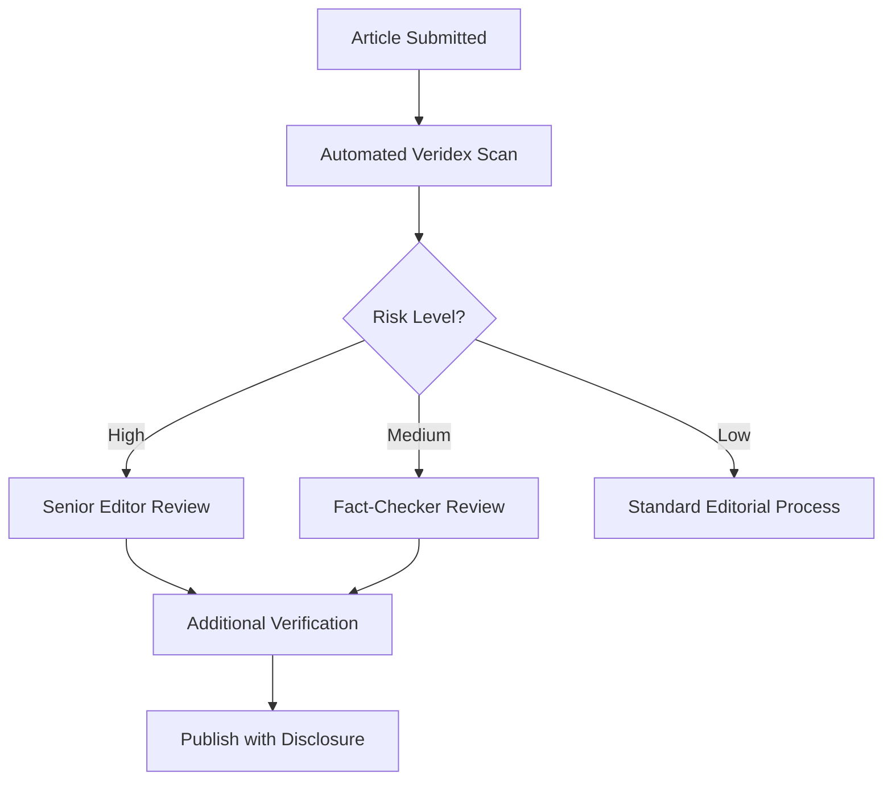

# Use Cases

Real-world applications of Veridex for AI content detection.

---

## Overview

Veridex can be applied across various domains where detecting AI-generated content is critical. This guide explores practical use cases and implementation patterns.

---

## 1. Content Moderation

### Scenario

Social media platforms and online communities need to identify AI-generated spam, misinformation, or policy-violating content.

### Implementation

```python
from veridex.text import PerplexitySignal, StylometricSignal
from veridex.image import FrequencySignal

class ContentModerator:
    def __init__(self):
        self.text_detector = PerplexitySignal()
        self.image_detector = FrequencySignal()
    
    def moderate_post(self, post):
        results = {}
        
        # Check text content
        if post.get('text'):
            text_result = self.text_detector.run(post['text'])
            results['text'] = {
                'ai_probability': text_result.score,
                'confidence': text_result.confidence
            }
        
        # Check images
        if post.get('images'):
            image_results = []
            for img_path in post['images']:
                img_result = self.image_detector.run(img_path)
                image_results.append(img_result.score)
            results['images'] = {
                'avg_ai_probability': sum(image_results) / len(image_results)
            }
        
        # Apply moderation rules
        if results.get('text', {}).get('ai_probability', 0) > 0.8:
            return "FLAG_FOR_REVIEW"
        
        return "PASS"

# Usage
moderator = ContentModerator()
decision = moderator.moderate_post({
    'text': "Check this amazing AI-written content...",
    'images': ['image1.png', 'image2.png']
})
```

### Best Practices

- ✓ Use multiple signals for robust detection
- ✓ Set appropriate thresholds for your platform
- ✓ Always allow human review for flagged content
- ✓ Log decisions for auditing

---

## 2. Academic Integrity

### Scenario

Educational institutions need to detect AI-generated student submissions while respecting privacy and providing fair assessment.

### Implementation

```python
from veridex.text import BinocularsSignal, PerplexitySignal

class EssayChecker:
    def __init__(self):
        # Use high-accuracy detector for academic use
        self.primary_detector = BinocularsSignal(observer_id="distilgpt2", performer_id="gpt2")
        self.secondary_detector = PerplexitySignal()
    
    def analyze_essay(self, essay_text):
        # Run both detectors
        primary_result = self.primary_detector.run(essay_text)
        secondary_result = self.secondary_detector.run(essay_text)
        
        # Ensemble decision
        avg_score = (primary_result.score + secondary_result.score) / 2
        avg_confidence = (primary_result.confidence + secondary_result.confidence) / 2
        
        # Conservative thresholds for academic use
        if avg_score > 0.85 and avg_confidence > 0.75:
            return {
                'status': 'LIKELY_AI_GENERATED',
                'recommendation': 'MANUAL_REVIEW_REQUIRED',
                'confidence': avg_confidence,
                'details': {
                    'binoculars_score': primary_result.score,
                    'perplexity_score': secondary_result.score,
                    'perplexity': primary_result.metadata.get('mean_perplexity')
                }
            }
        elif avg_score > 0.6:
            return {
                'status': 'UNCERTAIN',
                'recommendation': 'CONSIDER_INTERVIEW',
                'confidence': avg_confidence
            }
        else:
            return {
                'status': 'LIKELY_HUMAN_WRITTEN',
                'confidence': avg_confidence
            }

# Usage
checker = EssayChecker()
result = checker.analyze_essay(student_essay)

if result['status'] == 'LIKELY_AI_GENERATED':
    print(f"⚠️  Essay flagged for review (confidence: {result['confidence']:.2%})")
```

### Ethical Considerations

!!! warning "Important Guidelines"
    - Never use as sole evidence for academic misconduct
    - Always provide students opportunity to explain
    - Combine with other indicators (writing style changes, interview)
    - Be transparent about detection methods used
    - Regularly update detectors as AI models evolve

---

## 3. Journalism & Fact-Checking

### Scenario

News organizations need to verify content authenticity and detect AI-generated misinformation.

### Implementation

```python
from veridex.text import PerplexitySignal
from veridex.image import FrequencySignal, ELASignal
from veridex.audio import Wav2VecSignal

class FactChecker:
    def __init__(self):
        self.text_detector = PerplexitySignal()
        self.image_detector_1 = FrequencySignal()
        self.image_detector_2 = ELASignal()
        self.audio_detector = Wav2VecSignal()
    
    def verify_article(self, article):
        report = {
            'article_id': article['id'],
            'findings': []
        }
        
        # Analyze text
        text_result = self.text_detector.run(article['content'])
        if text_result.score > 0.7:
            report['findings'].append({
                'type': 'TEXT',
                'concern': 'Potentially AI-generated text',
                'confidence': text_result.confidence,
                'score': text_result.score
            })
        
        # Analyze images (check for manipulation)
        for img_path in article.get('images', []):
            freq_result = self.image_detector_1.run(img_path)
            ela_result = self.image_detector_2.run(img_path)
            
            if freq_result.score > 0.75 or ela_result.score > 0.75:
                report['findings'].append({
                    'type': 'IMAGE',
                    'file': img_path,
                    'concern': 'Potential AI generation or manipulation',
                    'freq_score': freq_result.score,
                    'ela_score': ela_result.score
                })
        
        # Analyze audio/video quotes
        for audio_path in article.get('audio_clips', []):
            audio_result = self.audio_detector.run(audio_path)
            if audio_result.score > 0.8:
                report['findings'].append({
                    'type': 'AUDIO',
                    'file': audio_path,
                    'concern': 'Potential voice deepfake',
                    'score': audio_result.score
                })
        
        report['risk_level'] = self._assess_risk(report['findings'])
        return report
    
    def _assess_risk(self, findings):
        if len(findings) >= 3:
            return 'HIGH'
        elif len(findings) >= 1:
            return 'MEDIUM'
        return 'LOW'
```

### Workflow Integration



---

## 4. Legal & Forensic Discovery

### Scenario

Law firms need to identify AI-generated documents in discovery processes.

### Implementation

```python
from veridex.text import BinocularsSignal, PerplexitySignal
import pandas as pd

class ForensicAnalyzer:
    def __init__(self):
        self.detector_high_accuracy = BinocularsSignal(observer_id="distilgpt2", performer_id="gpt2")
        self.detector_fast = PerplexitySignal()
    
    def analyze_document_batch(self, documents):
        results = []
        
        for doc in documents:
            # Quick scan first
            quick_result = self.detector_fast.run(doc['text'])
            
            # If flagged, run detailed analysis
            if quick_result.score > 0.6:
                detailed_result = self.detector_high_accuracy.run(doc['text'])
                
                results.append({
                    'document_id': doc['id'],
                    'filename': doc['filename'],
                    'ai_probability': detailed_result.score,
                    'confidence': detailed_result.confidence,
                    'flagged': detailed_result.score > 0.75,
                    'timestamp': doc.get('created_at'),
                    'metadata': detailed_result.metadata
                })
            else:
                results.append({
                    'document_id': doc['id'],
                    'filename': doc['filename'],
                    'ai_probability': quick_result.score,
                    'flagged': False
                })
        
        return pd.DataFrame(results)
    
    def generate_report(self, results_df):
        return {
            'total_documents': len(results_df),
            'flagged_documents': len(results_df[results_df['flagged']]),
            'avg_ai_probability': results_df['ai_probability'].mean(),
            'high_confidence_flags': len(results_df[
                (results_df['flagged']) & (results_df['confidence'] > 0.8)
            ])
        }
```

---

## 5. Enterprise Content Compliance

### Scenario

Companies need to ensure customer-facing content complies with disclosure requirements for AI-generated materials.

### Implementation

```python
from veridex.text import PerplexitySignal
from veridex.image import FrequencySignal

class ComplianceScanner:
    def __init__(self, threshold=0.7):
        self.text_detector = PerplexitySignal()
        self.image_detector = FrequencySignal()
        self.threshold = threshold
    
    def scan_marketing_content(self, content):
        violations = []
        
        # Check text
        text_result = self.text_detector.run(content['text'])
        if text_result.score > self.threshold:
            if not content.get('ai_disclosure'):
                violations.append({
                    'type': 'MISSING_AI_DISCLOSURE',
                    'element': 'text',
                    'ai_probability': text_result.score
                })
        
        # Check images
        for img in content.get('images', []):
            img_result = self.image_detector.run(img['path'])
            if img_result.score > self.threshold:
                if not img.get('ai_disclosure'):
                    violations.append({
                        'type': 'MISSING_AI_DISCLOSURE',
                        'element': f"image:{img['path']}",
                        'ai_probability': img_result.score
                    })
        
        return {
            'compliant': len(violations) == 0,
            'violations': violations,
            'requires_action': len(violations) > 0
        }
```

---

## 6. Research & Dataset Curation

### Scenario

Researchers need to filter AI-generated samples from datasets or validate data provenance.

### Implementation

```python
from veridex.text import PerplexitySignal
import json

class DatasetCurator:
    def __init__(self):
        self.detector = PerplexitySignal()
    
    def curate_text_dataset(self, dataset_path, output_path):
        with open(dataset_path) as f:
            data = json.load(f)
        
        curated = {
            'human_samples': [],
            'ai_samples': [],
            'uncertain_samples': []
        }
        
        for sample in data:
            result = self.detector.run(sample['text'])
            
            sample['veridex_score'] = result.score
            sample['veridex_confidence'] = result.confidence
            
            if result.score < 0.3 and result.confidence > 0.6:
                curated['human_samples'].append(sample)
            elif result.score > 0.7 and result.confidence > 0.6:
                curated['ai_samples'].append(sample)
            else:
                curated['uncertain_samples'].append(sample)
        
        with open(output_path, 'w') as f:
            json.dump(curated, f, indent=2)
        
        return {
            'total': len(data),
            'human': len(curated['human_samples']),
            'ai': len(curated['ai_samples']),
            'uncertain': len(curated['uncertain_samples'])
        }
```

---

## Best Practices Across Use Cases

### 1. Set Appropriate Thresholds

Different use cases require different confidence thresholds:

| Use Case | Threshold | Rationale |
|----------|-----------|-----------|
| Content Moderation | 0.7-0.8 | Balance false positives/negatives |
| Academic Integrity | 0.85+ | Avoid false accusations |
| Journalism | 0.75+ | Protect reputation |
| Legal | 0.90+ | High stakes require high certainty |

### 2. Always Provide Context

```python
def format_result_for_user(result, use_case='general'):
    message = f"AI Probability: {result.score:.2%}\n"
    message += f"Confidence: {result.confidence:.2%}\n\n"
    
    if use_case == 'academic':
        message += "⚠️  This is a detection tool, not proof. "
        message += "Please review manually before taking action."
    elif use_case == 'moderation':
        message += "✓ This content has been flagged for review."
    
    return message
```

### 3. Log and Audit

```python
import logging

logger = logging.getLogger('veridex_audit')

def log_detection(content_id, result, action_taken):
    logger.info({
        'content_id': content_id,
        'ai_probability': result.score,
        'confidence': result.confidence,
        'action': action_taken,
        'timestamp': datetime.now().isoformat()
    })
```

---

## Next Steps

- [Quick Start Tutorial](tutorials/quick_start.md)
- [API Reference](api/core.md)
- [Performance Optimization](performance.md)
- [FAQ](faq.md)
