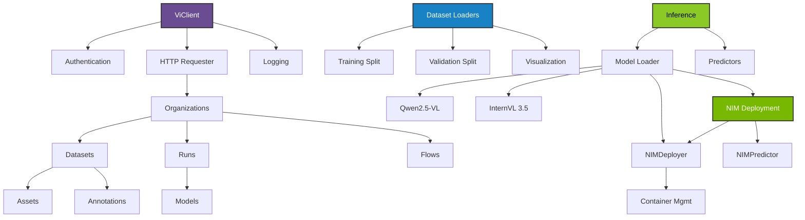

# User Guide Overview

Welcome to the Vi SDK user guide! This comprehensive guide will help you master all aspects of the SDK.

## What is Vi SDK?

Vi SDK is a Python library for interacting with the Datature Vi platform. It provides:

- **Dataset Management** - Upload, download, and manage computer vision datasets
- **Asset Operations** - Handle images and media files efficiently
- **Annotation Workflows** - Create and manage annotations for various vision tasks
- **Model Training** - Train models on Datature's infrastructure
- **Inference** - Run inference with vision-language models
- **Data Loading** - Efficient data loading for training pipelines

## Core Concepts

### Client & Authentication

The `ViClient` is your main interface to the platform:

```python
import vi

client = vi.Client(
    secret_key="your-secret-key",
    organization_id="your-organization-id"
)
```

[Learn more about authentication →](../getting-started/authentication.md)

### Resource Hierarchy

Resources are organized in a flat structure:

```
Organization
Datasets
Assets
Annotations
Runs
Models
Flows
```

Access them through the client:

```python
# Organization level
org = client.organizations.info()

# Dataset level
datasets = client.datasets.list()

# Asset level
assets = client.assets.list(dataset_id="...")
```

### Pagination

List operations return paginated responses:

```python
# Automatic pagination - iterate all pages
for page in client.datasets.list():
    for dataset in page.items:
        print(dataset.name)

# Or iterate all items across pages
for dataset in client.datasets.list().all_items():
    print(dataset.name)
```

[Learn more about pagination →](../api/pagination.md)

### Error Handling

All operations can raise structured errors:

```python
from vi import ViError, ViNotFoundError, ViAuthenticationError

try:
    dataset = client.datasets.get("dataset-id")
except ViNotFoundError as e:
    print(f"Not found: {e.message}")
except ViError as e:
    print(f"Error: {e.error_code}")
    if e.is_retryable():
        # Retry logic here
        pass
```

[Learn more about error handling →](error-handling.md)

## Guide Structure

This user guide is organized into sections covering different aspects of the SDK:

### Getting Started

- [Installation](../getting-started/installation.md) - Install and set up
- [Quickstart](../getting-started/quickstart.md) - Get started in 5 minutes
- [Authentication](../getting-started/authentication.md) - Configure credentials
- [Configuration](../getting-started/configuration.md) - Configure the SDK

### Working with Data

- [Datasets](datasets.md) - Manage datasets
- [Assets](assets.md) - Upload and download assets
- [Annotations](annotations.md) - Work with annotations
- [Dataset Loaders](dataset-loaders.md) - Load data for training

### Training & Inference

- [Models](models.md) - Train and download models
- [Inference](inference.md) - Run inference with trained models
- [NIM Deployment](nim-deployment.md) - Deploy NVIDIA NIM containers

### Advanced Topics

- [Error Handling](error-handling.md) - Handle errors gracefully
- [Logging](logging.md) - Configure structured logging
- [Performance](overview.md#performance) - Optimize operations

## Common Workflows

### Download and Load Dataset

```python
import vi
from vi.dataset.loaders import ViDataset

# Initialize client
client = vi.Client()

# Download dataset
downloaded = client.get_dataset(
    dataset_id="dataset_abc123",
    save_dir="./data"
)

# Load with dataset loader
dataset = ViDataset(downloaded.save_dir)

# Iterate training data
for asset, annotations in dataset.training.iter_pairs():
    # Your training code here
    pass
```

### Upload Assets to Dataset

```python
# Upload single file
result = client.assets.upload(
    dataset_id="dataset_abc123",
    paths="image.jpg"
)
print(f"✓ Uploaded: {result.total_succeeded} assets")

# Upload folder (automatically batched for large uploads)
result = client.assets.upload(
    dataset_id="dataset_abc123",
    paths="./images/",
    wait_until_done=True
)

# Access aggregated statistics
print(f"✓ Uploaded: {result.total_succeeded} assets")
print(f"Success rate: {result.success_rate:.1f}%")
print(result.summary())  # Rich formatted output
```

### Train and Download Model

```python
# List training runs
runs = client.runs.list()

# Download trained model
model = client.get_model(
    run_id="run_xyz789",
    save_path="./models"
)

# Use for inference
from vi.inference import ViModel

model = ViModel(
    secret_key="your-secret-key",
    organization_id="your-organization-id",
    run_id="your-run-id"
)
result, error = model(source="test.jpg", user_prompt="Describe this image")
```

## Performance

### Concurrent Operations

Upload and download operations automatically use concurrent connections:

- **Uploads**: 8-32 concurrent uploads (CPU-dependent)
- **Downloads**: 8-64 concurrent downloads (CPU-dependent)

This is handled automatically for optimal performance.

### Memory Management

Dataset loaders use lazy loading:

```python
dataset = ViDataset("./data/large-dataset")

# Assets loaded on-demand, not all at once
for asset, annotations in dataset.training.iter_pairs():
    # Only current asset in memory
    process(asset, annotations)
```

### Progress Tracking

Control progress bar visibility:

```python
# With progress (default)
dataset = client.get_dataset(dataset_id="...", show_progress=True)

# Without progress (for scripts/CI)
dataset = client.get_dataset(dataset_id="...", show_progress=False)
```

## Best Practices

### 1. Use Environment Variables

```python
import os

client = vi.Client(
    secret_key=os.getenv("DATATURE_VI_SECRET_KEY"),
    organization_id=os.getenv("DATATURE_VI_ORGANIZATION_ID")
)
```

### 2. Handle Errors Appropriately

```python
from vi import ViError

try:
    # Your operations
    pass
except ViError as e:
    logger.error(f"Operation failed: {e.message}")
    if e.is_retryable():
        # Implement retry logic
        pass
```

### 3. Use Pagination Efficiently

```python
# Process items as you iterate (memory efficient)
for page in client.datasets.list():
    for dataset in page.items:
        process(dataset)
```

### 4. Configure Logging

```python
from vi.logging import LoggingConfig, LogLevel

config = LoggingConfig(
    level=LogLevel.INFO,
    enable_console=True,
    enable_file=True
)

client = vi.Client(
    secret_key="...",
    organization_id="...",
    logging_config=config
)
```

### 5. Clean Up Resources

```python
# Close HTTP connections when done
client.requester.close()
```

## Next Steps

<div class="grid cards" markdown>

-   :material-database:{ .lg .middle } __Datasets__

    ---

    Learn how to manage datasets

    [:octicons-arrow-right-24: Dataset guide](datasets.md)

-   :material-image-multiple:{ .lg .middle } __Assets__

    ---

    Upload and download assets

    [:octicons-arrow-right-24: Asset guide](assets.md)

-   :material-tag-multiple:{ .lg .middle } __Annotations__

    ---

    Work with annotations

    [:octicons-arrow-right-24: Annotation guide](annotations.md)

-   :material-brain:{ .lg .middle } __Models__

    ---

    Train and use models

    [:octicons-arrow-right-24: Model guide](models.md)

</div>

## Getting Help

- **Documentation**: Use the search bar above
- **Examples**: Check the [examples](https://github.com/datature/Vi-SDK/tree/main/pypi/vi-sdk/examples/pypi/vi-sdk/examples) section
- **API Reference**: See the [API documentation](../api/client.md)
- **Issues**: Report bugs on [GitHub](https://github.com/datature/Vi-SDK/issues)
- **Email**: Contact [developers@datature.io](mailto:developers@datature.io)

## SDK Architecture



## Feature Comparison

| Feature | Support | Documentation |
|---------|---------|---------------|
| Dataset Management | ✅ Full | [Guide](datasets.md) |
| Asset Upload | ✅ Full | [Guide](assets.md) |
| Asset Download | ✅ Full | [Guide](assets.md) |
| Annotations | ✅ Full | [Guide](annotations.md) |
| Model Training | ✅ Full | [Guide](models.md) |
| Model Inference | ✅ Full | [Guide](inference.md) |
| NIM Deployment | ✅ Full | [Guide](nim-deployment.md) |
| Dataset Loaders | ✅ Full | [Guide](dataset-loaders.md) |
| Phrase Grounding | ✅ Full | [Example](https://github.com/datature/Vi-SDK/tree/main/pypi/vi-sdk/examples/pypi/vi-sdk/examples) |
| VQA | ✅ Full | [Example](https://github.com/datature/Vi-SDK/tree/main/pypi/vi-sdk/examples/pypi/vi-sdk/examples) |
| Structured Logging | ✅ Full | [Guide](logging.md) |
| Progress Tracking | ✅ Full | - |
| Error Handling | ✅ Full | [Guide](error-handling.md) |

## Supported Python Versions

Vi SDK requires Python 3.10 or higher.

| Python Version | Support | Notes |
|----------------|---------|-------|
| 3.10 | ✅ Full | Minimum required version |
| 3.11 | ✅ Full | Recommended |
| 3.12 | ✅ Full | Recommended |
| 3.13 | ✅ Full | Latest features |

## Platform Support

| Platform | Support | Notes |
|----------|---------|-------|
| Linux | ✅ Full | Ubuntu 20.04+, Debian 11+ |
| macOS | ✅ Full | macOS 11+ (both Intel and Apple Silicon) |
| Windows | ✅ Full | Windows 10+ |
| Docker | ✅ Full | Official images coming soon |

---

**Ready to dive deeper?** Choose a topic from the menu or continue with the [Datasets guide](datasets.md).
