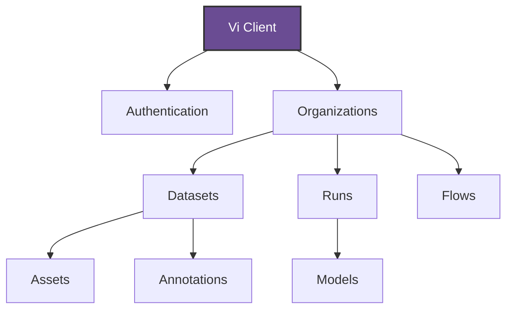
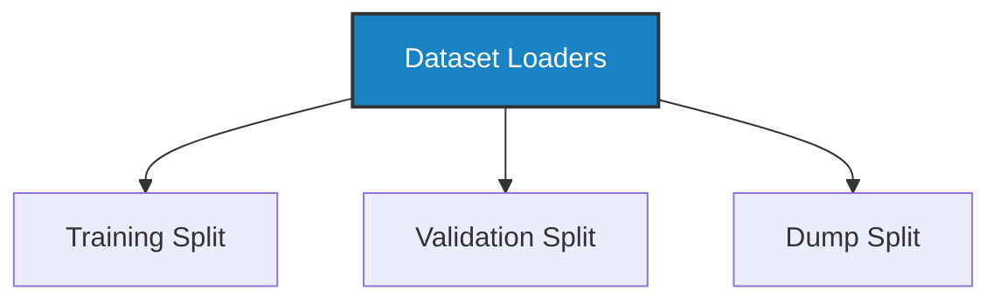
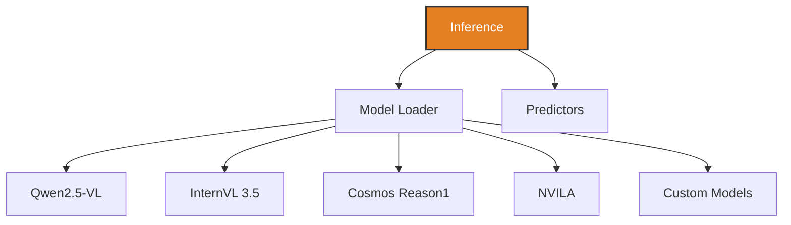
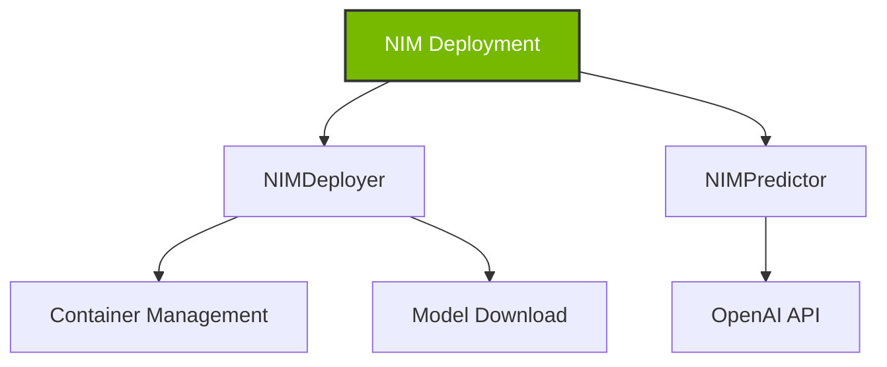

# Vi SDK Documentation

<div align="center">


**Powerful Python SDK for the Datature Vi Platform**

[](https://badge.fury.io/py/vi)
[](https://pypi.org/project/vi/)
[](https://opensource.org/licenses/Apache-2.0)
[](https://vi.readthedocs.io/en/latest/?badge=latest)

</div>

---

## What is Vi SDK?

The **Vi SDK** is a comprehensive Python library for interacting with the Datature Vi platform. It provides a clean, intuitive API for managing computer vision datasets, annotations, training models, and performing inference with state-of-the-art vision-language models.

## Key Features

<div class="grid cards" markdown>

-   :material-cloud-upload:{ .lg .middle } __Dataset Management__

    ---

    Upload, download, and manage datasets with ease. Support for multiple annotation formats and efficient batch operations.

    [:octicons-arrow-right-24: Learn more](guide/datasets.md)

-   :material-image-multiple:{ .lg .middle } __Asset Operations__

    ---

    Handle images and assets with concurrent upload/download, progress tracking, and automatic format detection.

    [:octicons-arrow-right-24: Asset guide](guide/assets.md)

-   :material-tag-multiple:{ .lg .middle } __Annotation Workflows__

    ---

    Create, update, and manage annotations for phrase grounding, VQA, and other vision tasks.

    [:octicons-arrow-right-24: Annotation guide](guide/annotations.md)

-   :material-brain:{ .lg .middle } __Model Training & Inference__

    ---

    Train models on Datature's infrastructure and run inference with vision-language models like Qwen2.5-VL, InternVL 3.5, Cosmos Reason1, and NVILA.

    [:octicons-arrow-right-24: Model operations](guide/models.md)

-   :material-lightning-bolt:{ .lg .middle } __High Performance__

    ---

    Built with performance in mind - concurrent operations, streaming downloads, and efficient memory usage.

    [:octicons-arrow-right-24: Performance tips](guide/overview.md#performance)

-   :material-code-braces:{ .lg .middle } __Developer Friendly__

    ---

    Type hints, comprehensive error handling, structured logging, and extensive documentation.

    [:octicons-arrow-right-24: API reference](api/client.md)

</div>

## Quick Example

```python
import vi

# Initialize client
client = vi.Client(
    secret_key="your-secret-key",
    organization_id="your-org-id"
)

# List datasets
for page in client.datasets.list():
    for dataset in page.items:
        print(f"Dataset: {dataset.name} (ID: {dataset.dataset_id})")

# Download a dataset
dataset = client.get_dataset(
    dataset_id="your-dataset-id",
    save_dir="./data"
)

# Load dataset for training
from vi.dataset.loaders import ViDataset

dataset = ViDataset("./data/your-dataset-id")
print(f"Total assets: {dataset.info().total_assets}")

# Iterate through training split
for asset, annotations in dataset.training.iter_pairs():
    print(f"Processing: {asset.filename}")
    for annotation in annotations:
        print(f"  - {annotation.contents}")
```

## Installation

Install Vi SDK using pip:

```bash
pip install vi-sdk
```

For additional features:

```bash
# With inference support (Qwen2.5-VL, InternVL 3.5, Cosmos Reason1, NVILA and other models)
pip install vi-sdk[inference]

# Install all features
pip install vi-sdk[all]
```

## Architecture Overview

### Vi Client



### Dataset Loaders



### Inference



### NIM Deployment



## Core Concepts

### Client & Authentication

The `ViClient` is your entry point to the Vi platform. It handles authentication, request management, and provides access to all resources.

```python
import vi

# Using API key
client = vi.Client(
    secret_key="your-secret-key",
    organization_id="your-org-id"
)

# Using config file
client = vi.Client(config_file="~/datature/vi/config.json")

# With custom logging
from vi.logging import LoggingConfig, LogLevel

logging_config = LoggingConfig(
    level=LogLevel.DEBUG,
    enable_console=True
)
client = vi.Client(
    secret_key="your-secret-key",
    organization_id="your-org-id",
    logging_config=logging_config
)
```

### Resource Hierarchy

Vi SDK follows the platform's resource hierarchy:

```
Organization
├── Datasets
│   ├── Assets
│   └── Annotations
├── Runs
│   └── Models
└── Flows
```

Access resources through the client:

```python
# Access organization
org = client.organizations.info()

# Access datasets
datasets = client.datasets.list()

# Access assets within a dataset
assets = client.assets.list(dataset_id="...")

# Access models from runs
models = client.models.list(run_id="...")
```

### Error Handling

Vi SDK provides comprehensive error handling with structured error codes:

```python
from vi import (
    ViError,
    ViAuthenticationError,
    ViNotFoundError,
    ViValidationError
)

try:
    dataset = client.datasets.get("invalid-id")
except ViNotFoundError as e:
    print(f"Dataset not found: {e.message}")
    print(f"Suggestion: {e.suggestion}")
except ViAuthenticationError as e:
    print(f"Authentication failed: {e.message}")
except ViError as e:
    print(f"Error: {e.error_code} - {e.message}")
```

### Pagination

Automatic pagination support for listing resources:

```python
# Iterate over all pages automatically
for page in client.datasets.list():
    for dataset in page.items:
        print(dataset.name)

# Access just the first page
first_page = client.datasets.list()
print(f"First page has {len(first_page.items)} items")

# Iterate over all items across all pages
datasets = client.datasets.list()
for dataset in datasets.all_items():
    print(dataset.name)

# Manual pagination with page size
from vi.api.types import PaginationParams

pagination = PaginationParams(page_size=50)
datasets = client.datasets.list(pagination=pagination)
```

## Supported Features

| Feature | Status | Documentation |
|---------|--------|---------------|
| Dataset Management | ✅ | [Guide](guide/datasets.md) |
| Asset Upload/Download | ✅ | [Guide](guide/assets.md) |
| Annotation Management | ✅ | [Guide](guide/annotations.md) |
| Model Training | ✅ | [Guide](guide/models.md) |
| Model Inference | ✅ | [Guide](guide/inference.md) |
| NIM Deployment | ✅ | [Guide](guide/nim-deployment.md) |
| Dataset Loaders | ✅ | [Guide](guide/dataset-loaders.md) |
| Phrase Grounding | ✅ | [Guide](guide/inference.md) |
| VQA (Visual Question Answering) | ✅ | [Guide](guide/inference.md) |
| Structured Logging | ✅ | [Guide](guide/logging.md) |
| Progress Tracking | ✅ | - |
| Concurrent Operations | ✅ | - |

## Next Steps

<div class="grid cards" markdown>

-   :material-clock-fast:{ .lg .middle } __Quickstart__

    ---

    Get up and running in 5 minutes with our quickstart guide

    [:octicons-arrow-right-24: Quickstart](getting-started/quickstart.md)

-   :material-book-open-variant:{ .lg .middle } __User Guide__

    ---

    Comprehensive guides for all features

    [:octicons-arrow-right-24: User guide](guide/overview.md)

-   :material-code-tags:{ .lg .middle } __API Reference__

    ---

    Detailed API documentation with examples

    [:octicons-arrow-right-24: API docs](api/client.md)

-   :material-lightbulb-on:{ .lg .middle } __Examples__

    ---

    Real-world runnable Python examples and use cases

    [:octicons-arrow-right-24: View Examples on GitHub](https://github.com/datature/Vi-SDK/tree/main/pypi/vi-sdk/examples/pypi/vi-sdk/examples)

</div>

## Need Help?

- **Documentation**: You're reading it! Use the search bar above to find what you need
- **GitHub Issues**: Report bugs or request features at [github.com/datature/Vi-SDK/issues](https://github.com/datature/Vi-SDK/issues)
- **Email Support**: Reach out to [developers@datature.io](mailto:developers@datature.io)
- **Community**: Join our community discussions

## License

Vi SDK is licensed under the Apache License 2.0. See [LICENSE](https://github.com/datature/Vi-SDK/blob/main/LICENSE) for details.
