# whatsthedamage Architecture Overview

## Purpose
`whatsthedamage` is an open-source Python tool for processing bank transaction CSV exports. It provides both a command-line interface (CLI) and a Flask-based web interface for categorizing, filtering, and summarizing transactions. The project supports customizable CSV formats, localization, and experimental machine learning-based categorization.

## High-Level Structure
The project follows a Model-View-Controller (MVC) and Service Layer patterns for clear separation of concerns:

- **Models**: Data representation, row processing, enrichment, filtering, summarization, and ML logic.
- **Views**: Output formatting for console, HTML, and CSV.
- **Controllers**: CLI and web routing, orchestration of processing.
- **Config**: Centralized configuration, context, and pattern sets.
- **Scripts**: ML model training, feature engineering, documentation.
- **Services**: Place for business logic.

### Architecture decisions
- Dependencies point inward (Controller → Service → Model), never outward.
- Single Responsibility Principle: Each service has a clear, focused purpose.
- Dependency Injection: Services are injected into controllers for testability.
- Service Layer Pattern: Business logic isolated from delivery mechanisms (CLI/Web/API).
- Calculator Pattern: Extensibility for custom transaction calculations.
- API Versioning: Explicit versioning in URLs for backward compatibility.

## Visual Architecture Diagram

```mermaid
graph TB
    subgraph "Presentation Layer"
        CLI[CLI<br/>cli_app.py<br/>CLIController]
        WEB[Web Routes<br/>routes.py<br/>routes_helpers]
        API[REST API v2<br/>endpoints.py]
    end

    subgraph "Service Layer"
        PS[ProcessingService<br/>orchestrates CSV processing]
        VS[ValidationService<br/>file validation]
        CS[ConfigurationService<br/>config loading]
        SS[SessionService<br/>web sessions]
        FUS[FileUploadService<br/>file handling]
        RBS[ResponseBuilderService<br/>response construction]
        DFS[DataFormattingService<br/>output formatting]
    end

    subgraph "Model Layer"
        CSVP[CSVProcessor<br/>orchestration]
        RP[RowsProcessor<br/>main processing]
        CFH[CsvFileHandler<br/>CSV parsing]
        RF[RowFilter<br/>date filtering]
        RE[RowEnrichment<br/>regex categorization]
        REML[RowEnrichmentML<br/>ML categorization]
        DTRB[DataTablesResponseBuilder<br/>API v2 structure]
        CR[CsvRow<br/>data model]
        CALC[dt_calculators<br/>Balance & Total Spendings]
    end

    subgraph "Configuration"
        AC[AppContext<br/>config + args]
        CONFIG[config.yml<br/>CSV format, patterns]
        PATTERNS[EnricherPatternSets<br/>regex patterns]
        MLMODEL[machine_learning.py<br/>joblib model]
    end

    subgraph "View/Output"
        RP_VIEW[row_printer.py<br/>console output]
        FORMS[forms.py<br/>Flask forms]
        TEMPLATES[Jinja2 Templates<br/>HTML rendering]
    end

    subgraph "Utilities"
        LOCALE[gettext/i18n<br/>localization]
        DATECONV[DateConverter<br/>date handling]
    end

    %% CLI Flow
    CLI --> |process_with_details|PS
    CLI --> DFS

    %% Web Flow
    WEB --> |file upload|FUS
    WEB --> |validation|VS
    WEB --> |process|PS
    WEB --> |session|SS
    WEB --> FORMS
    WEB --> TEMPLATES

    %% API Flow
    API --> |process_with_details|PS
    API --> |validation|VS
    API --> |response|RBS

    %% Service Layer Dependencies
    PS --> CS
    PS --> CSVP
    CS --> CONFIG
    RBS --> DFS

    %% CSVProcessor Flow
    CSVP --> RP
    CSVP --> CFH
    CSVP --> DFS
    CSVP --> AC

    %% RowsProcessor Flow
    RP --> AC
    RP --> RF
    RP --> RE
    RP --> REML
    RP --> DTRB
    RP --> RP_VIEW

    %% Model Dependencies
    CFH --> CR
    RE --> PATTERNS
    REML --> MLMODEL
    DTRB --> CALC
    DTRB --> CR

    %% Configuration Flow
    AC --> CONFIG
    AC --> PATTERNS

    %% Utilities
    DFS --> LOCALE
    RP --> DATECONV
    DTRB --> DATECONV

    %% Styling
    classDef presentation fill:#e1f5ff,stroke:#01579b,stroke-width:2px
    classDef service fill:#f3e5f5,stroke:#4a148c,stroke-width:2px
    classDef model fill:#fff3e0,stroke:#e65100,stroke-width:2px
    classDef config fill:#f1f8e9,stroke:#33691e,stroke-width:2px
    classDef view fill:#fce4ec,stroke:#880e4f,stroke-width:2px
    classDef utils fill:#e8f5e9,stroke:#2e7d32,stroke-width:2px

    class CLI,WEB,API presentation
    class PS,VS,CS,SS,FUS,RBS,DFS service
    class CSVP,RP,CFH,RF,RE,REML,RS,DTRB,CR,CALC model
    class AC,CONFIG,PATTERNS,MLMODEL config
    class RP_VIEW,FORMS,TEMPLATES view
    class LOCALE,DATECONV utils
```

### Architecture Flow Explanation

**Layers (Top to Bottom):**

1. **Presentation Layer** (Blue): Three entry points
   - CLI (`cli_app.py` + `CLIController`) - command-line interface
   - Web Routes (`routes.py` + `routes_helpers.py`) - Flask web interface
   - REST API v2 - detailed transactions with DataTables support

2. **Service Layer** (Purple): Business logic (v0.8.0+)
   - `ProcessingService` - orchestrates CSV processing, used by all interfaces
   - `ValidationService` - validates uploaded files
   - `ConfigurationService` - loads and manages configuration
   - `SessionService` - manages web session state
   - `FileUploadService` - handles file uploads for web/API
   - `ResponseBuilderService` - constructs appropriate API responses
   - `DataFormattingService` - formats data for output (HTML, CSV, JSON, console)

3. **Model Layer** (Orange): Core data processing
   - `CSVProcessor` - main orchestrator, used by ProcessingService
   - `RowsProcessor` - coordinates filtering, enrichment, summarization
   - `CsvFileHandler` - parses CSV into `CsvRow` objects
   - `RowFilter` - filters by date range
   - `RowEnrichment` - regex-based categorization using patterns
   - `RowEnrichmentML` - ML-based categorization using trained model
   - `DataTablesResponseBuilder` - builds API v2 responses with calculators
   - `dt_calculators` - Balance and Total Spendings calculations (calculator pattern)

4. **Configuration** (Green): Settings and patterns
   - `AppContext` - wraps config + args
   - `config.yml` - CSV format, attribute mappings, patterns
   - `EnricherPatternSets` - type/partner regex patterns
   - `machine_learning.py` - ML model loading/prediction

5. **View/Output** (Pink): Presentation formatting
   - `row_printer.py` - console output formatting
   - `forms.py` - Flask WTForms
   - Jinja2 templates - HTML rendering

6. **Utilities** (Light Green): Cross-cutting concerns
   - gettext/i18n - localization (English, Hungarian)
   - `DateConverter` - date parsing and formatting

**Key Data Flow:**
- **CLI**: CLIController → ProcessingService.process_with_details() → CSVProcessor.process_v2() → RowsProcessor.process_rows_v2() → DataFormattingService → console
- **Web**: Routes → FileUploadService + ValidationService → ProcessingService.process_with_details() → Templates
- **API v2**: endpoints → ValidationService → ProcessingService.process_with_details() → DataTablesResponseBuilder → JSON (detailed, multi-account)

**Important Patterns:**
- **Dependency Injection**: Services injected into controllers (Flask extensions)
- **Strategy Pattern**: Different enrichment strategies (regex vs ML)
- **Builder Pattern**: DataTablesResponseBuilder with calculator pattern
- **Calculator Pattern**: Extensible calculations (Balance, Total Spendings, custom)

## Major Components

### 1. Models (`src/whatsthedamage/models/`)
- **CsvRow**: Represents a single transaction row with account metadata (multi-account support).
- **RowsProcessor**: Orchestrates filtering, enrichment (regex/ML), categorization, and summarization. Uses v2 pipeline (`process_rows_v2()`).
- **RowEnrichment / RowEnrichmentML**: Categorization via regex or ML.
- **RowFilter**: Filters rows by date/month.
- **CsvFileHandler / CsvProcessor**: Reads and parses CSV files, manages row objects. Caches parsed rows in `_rows` for performance. Uses v2 pipeline (`process_v2()`).
- **DataTablesResponseBuilder**: Builds structured responses for API v2 and web interface, supports calculator pattern and performance optimizations.

### 2. Controllers (`src/whatsthedamage/controllers/`)
- **CLI Controller**: Entry point for command-line usage (`__main__.py`, `cli_app.py`).
- **Web Controller**: Flask routes for file upload, processing, and result rendering (`app.py`, `routes.py`).
- **API Controllers**: REST API v2 endpoints in `api/v2/` directory.
- **Orchestration**: Main logic (`whatsthedamage.py`) coordinates config loading, processing, and output.

### 3. Views (`src/whatsthedamage/view/`)
- **row_printer.py**: Console output formatting.
- **templates/**: Jinja2 templates for HTML output (server-side rendered web interface).
- **data_frame_formatter.py**: CSV/HTML table formatting.
- **Interactive elements**: JavaScript enhancements (fetch API, DataTables) for improved UX without full page reloads.

### 4. Config (`src/whatsthedamage/config/`)
- **config.py**: Central config, context, and pattern sets.
- **flask_config.py**: Web-specific config.
- **enricher_pattern_sets/**: Regex patterns for enrichment.

### 5. Scripts (`src/whatsthedamage/scripts/`)
- **ML Training**: Scripts for training, evaluating, and tuning ML models.
- **Documentation**: Sphinx docs and ML model details.

### 6. Services (`src/whatsthedamage/services/`)
Introduced in version 0.8.0 to extract business logic from controllers and enable dependency injection.

- **ProcessingService**: Core business logic for CSV processing, shared between web routes, CLI, and REST API. Uses v2 processing pipeline (`process_with_details()`) for multi-account support.
- **ValidationService**: File validation (type, size, content) without web-specific dependencies.
- **ConfigurationService**: Manages loading and access to configuration settings.
- **SessionService**: Handles session management for web interface.
- **FileUploadService**: Manages file upload operations and storage.
- **ResponseBuilderService**: Constructs responses for different output formats.
- **DataFormattingService**: Formats processed data for various output targets (console, HTML, CSV, JSON). Supports the unified DataTablesResponse format.

**Benefits**:
- Ensures consistent behavior across all interfaces (CLI, Web, API).
- Decouples processing logic from presentation/delivery layer.
- Improves testability through dependency injection.
- Enables reusability of business logic.

### 7. API Layer (`src/whatsthedamage/api/`)
- **REST API v2** (`/api/v2/`): Provides programmatic access to transaction processing.
- Uses Flask Blueprints for versioning (`v2_bp`).
- Returns JSON responses for automation, scripting, and potential mobile apps.
- Shares the same `ProcessingService` as web routes and CLI for consistency.
- **API Versioning Strategy**:
  - HTTP clients use explicit version in URL (`/api/v2/`).
  - CLI users choose package version via installation.
  - Explicit HTTP API versions in the URL for any breaking wire-level change.
  - Route handlers for unchanged endpoints can call shared functions.
- **Documentation**: API documentation available via `/docs` endpoint.

## Data Flow
1. **Input**: User uploads or specifies a CSV file (and optional config).
2. **Validation**: `ValidationService` verifies file type, size, and basic content integrity.
3. **Configuration**: `ConfigurationService` loads and provides config settings (CSV format, patterns, categories).
4. **Parsing**: `CsvFileHandler` reads and parses the CSV into `CsvRow` objects (with account metadata for multi-account support). Parsed rows are cached in `CSVProcessor._rows` to avoid re-reading.
5. **Processing**: `ProcessingService` orchestrates the core business logic via v2 pipeline:
   - `RowsProcessor.process_rows_v2()` filters, enriches, categorizes, and builds detailed transaction data.
   - Enrichment uses either regex patterns or ML model (if enabled).
   - Filtering by date/month, optional category filter.
   - Returns `DataTablesResponse` objects per account (unified canonical format).
6. **Aggregation**: `DataTablesResponseBuilder` computes totals per category/time period using calculator pattern (Balance, Total Spendings, custom). Supports performance optimization via `skip_details` flag for summary-only workflows.
7. **Formatting**: `DataFormattingService` prepares output from `DataTablesResponse` for console, HTML, CSV, or JSON.
8. **Response**: `ResponseBuilderService` constructs appropriate responses for the delivery channel.
9. **Output**: Results are displayed in CLI or rendered in the web frontend (HTML table, CSV download) or returned as JSON (API).

**Dependency Injection**: Services are injected into controllers, making the architecture testable and maintainable.

## Frontend Architecture: Hybrid Approach

The application uses a **hybrid server-side + progressive enhancement** architecture, combining the simplicity of server-side rendering with selective client-side interactivity.

### Web Interface (`/process/v2`, `/clear`)
- **Server-Side Rendering**: Flask renders HTML templates with Jinja2.
- **Form Submission**: Traditional POST requests for file uploads and processing.
- **Full Page Reloads**: Primary navigation pattern for simplicity and reliability.
- **Session Management**: Flask sessions handle user state between requests.

### Interactive Enhancements
- **JavaScript Fetch API**: Used for actions that don't require page reloads:
  - Form clearing (`/clear` endpoint)
- **DataTables Integration**: Client-side table enhancement for transaction results:
  - Sorting, searching, pagination without server round-trips
  - Fixed headers for better UX with large datasets
  - Export functionality (CSV/Excel) using DataTables Buttons extension
  - Operates on server-rendered HTML tables
- **Progressive Enhancement**: Core functionality works without JavaScript; JS adds convenience.

### REST API (`/api/v1/`, `/api/v2/`)
- **Purpose**: Programmatic access for automation, scripting, and potential mobile apps.
- **Separation**: API routes are separate from web routes but share the same service layer.
- **JSON Responses**: All API endpoints return structured JSON.
- **Use Cases**:
  - CI/CD pipelines for automated transaction analysis
  - Third-party integrations
  - Future mobile applications
  - Batch processing scripts

## Machine Learning Integration
- ML model (Random Forest) is trained on historical transaction data.
- Feature engineering uses TF-IDF for text, one-hot encoding for currency, and scaling for amounts.
- Model is loaded via joblib (security warning: only use trusted models).
- ML categorization is enabled via CLI/web flag (`--ml`).

## Development Tools & Workflow

### Makefile Commands (v0.8.0)
- `make dev`: Set up development environment with venv and dependencies.
- `make test`: Run tests using tox.
- `make ruff`: Run ruff linter/formatter (added in 0.8.0).
- `make mypy`: Run mypy type checker (added in 0.8.0).
- `make web`: Run Flask development server.
- `make docs`: Build Sphinx documentation.
- `make lang`: Extract translatable strings.
- `make compile-deps` / `update-deps`: Manage Python dependencies.

### Testing Strategy
- Unit tests for services (ProcessingService, ValidationService, etc.).
- API endpoint tests for v1 and v2.
- Type checking with mypy.
- Code quality with ruff.

## Localization
- Uses Python `gettext` for translation.
- Locale folders: `src/whatsthedamage/locale/en/`, `src/whatsthedamage/locale/hu/`.
- Translatable strings extracted via `make lang`.

## Configuration
- YAML config file defines CSV format, attribute mapping, enrichment patterns, and categories.
- Centralized in `config/config.py` and loaded at startup.

## Performance Optimizations

Version 0.9.0 introduces several performance improvements:

### CSV Processing Caching
- `CSVProcessor` caches parsed rows in `_rows` attribute to avoid re-reading files.
- Eliminates redundant CSV parsing when processing same file multiple times.
- Significantly reduces I/O overhead for large CSV files.

### Detail Row Optimization
- `DataTablesResponseBuilder` supports `skip_details=True` flag.
- Skips building `DetailRow` objects when only summary data is needed.
- Used by CLI, web summary route, and deprecated API v1.
- Reduces memory usage and processing time for summary-only workflows.

### Multi-Account Support
- `CsvRow` objects now include account metadata.
- Enables processing of multi-account CSV exports.
- Each account processed as separate entity with own currency metadata.
- `DataTablesResponse` structures organized per account.

## Extensibility

### Calculator Pattern
Introduced in version 0.8.0, the calculator pattern allows custom transaction calculations beyond built-in categorization:
- Define custom business logic for specific reporting needs.
- Implement custom calculators that process transaction data.
- Example implementations available in `docs/calculator_pattern_example.py`.
- Enables domain-specific extensions without modifying core code.

### Other Extension Points
- **Add Category**: Update config pattern sets and enrichment logic.
- **Support New CSV Format**: Adjust config and parsing logic in models.
- **ML Model**: Train/test via scripts; see `src/whatsthedamage/scripts/README.md`.
- **Custom Service**: Implement new services following dependency injection pattern.

## Security & Conventions
- Never log sensitive data (account numbers, personal info).
- Always validate user and file input.
- Close file handles promptly.
- Do not expose internal errors to end users.
- Known issue: joblib model loading can execute arbitrary code.

## Key Files & Directories
- `README.md`: Project overview, CLI usage, API documentation, config, categories.
- `ARCHITECTURE.md`: This file - detailed architecture documentation.
- `API.md`: Complete REST API documentation.
- `src/whatsthedamage/scripts/README.md`: ML details.
- `Makefile`: Workflow automation.
- `config/config.py`: Central config/context.
- `src/whatsthedamage/app.py`: Flask entrypoint.
- `src/whatsthedamage/view/templates/`: Web frontend templates.
- `src/whatsthedamage/api/`: REST API endpoints (v1, v2) and OpenAPI documentation.
- `src/whatsthedamage/services/`: Shared business logic layer (introduced in 0.8.0).
- `docs/calculator_pattern_example.py`: Calculator pattern implementation examples.
- `pyproject.toml`: Project metadata and dependencies.

---
For further details, see `README.md` (includes comprehensive feature list), `API.md` (REST API reference), and `src/whatsthedamage/scripts/README.md` (ML documentation).
